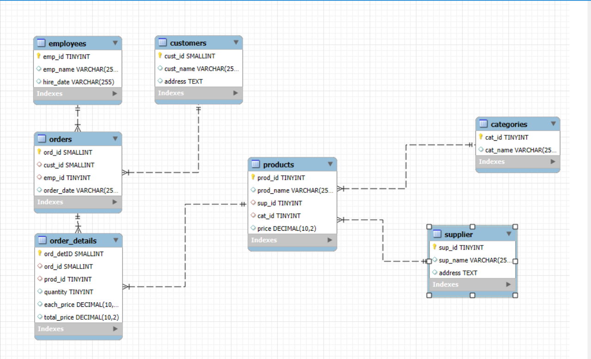

# Grocery Store Management 🛒

This project is a **MySQL database system** for managing a grocery store.
It includes the schema, sample queries, and analytical SQL to track **sales, products, suppliers, employees, and customers**.

---

## 📌 Features

* **Database schema** includes:

  * Suppliers
  * Categories
  * Employees
  * Customers
  * Products
  * Orders & Order Details

* **Queries for analysis**:

  * Product counts by category
  * Average price per category
  * Top-selling products
  * Supplier revenue contribution
  * Monthly & daily sales trends
  * Top 5 products by revenue in each category

---

## 🗂️ Project Structure

```
/Grocery_Store_Managment
│── Grocery_Store_Managment.sql   # Main SQL file (schema + queries)
│── README.md                     # Project documentation
│── er_diagram.png                # ER Diagram (Entity-Relationship Diagram)
```

---

## 📊 Entity Relationship Diagram (ERD)

The following diagram shows the structure and relationships of the database:



---

## ⚙️ Setup Instructions

1. Clone the repository:

   ```bash
   git clone https://github.com/prash930/Grocery_Store_Managment.git
   cd Grocery_Store_Managment
   ```

2. Import the database in MySQL:

   ```bash
   mysql -u <username> -p < Grocery_Store_Managment.sql
   ```

3. Or copy/paste the SQL into **MySQL Workbench** / **phpMyAdmin** and run it.

---

## 🛠️ Tech Stack

* **Database**: MySQL
* **Language**: SQL

---

## 🚀 Future Improvements

* Replace `TINYINT/SMALLINT` with `INT` for scalability
* Use `DATE` / `DATETIME` instead of `VARCHAR` for date fields
* Add indexes on frequently queried columns
* Provide **sample data inserts** for quick testing
* Build **front-end / dashboard** (React + Node.js or Power BI) for visualization

---

## 🤝 Contribution

Contributions are welcome!

1. Fork this repo
2. Create a new branch:

   ```bash
   git checkout -b feature-name
   ```
3. Commit your changes:

   ```bash
   git commit -m "Add new feature"
   ```
4. Push to branch:

   ```bash
   git push origin feature-name

